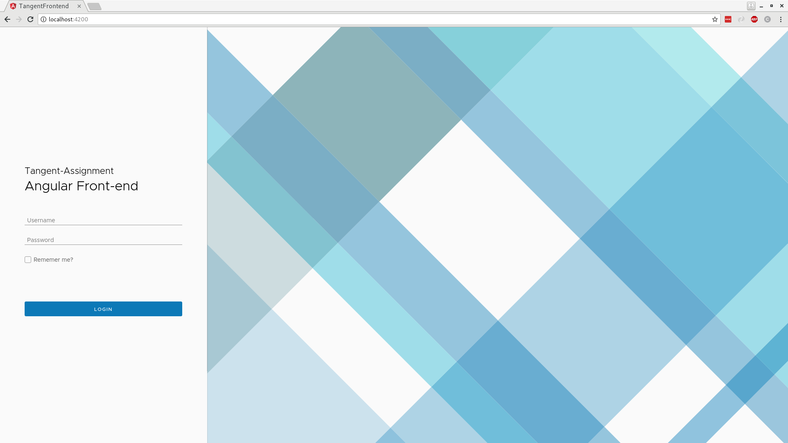
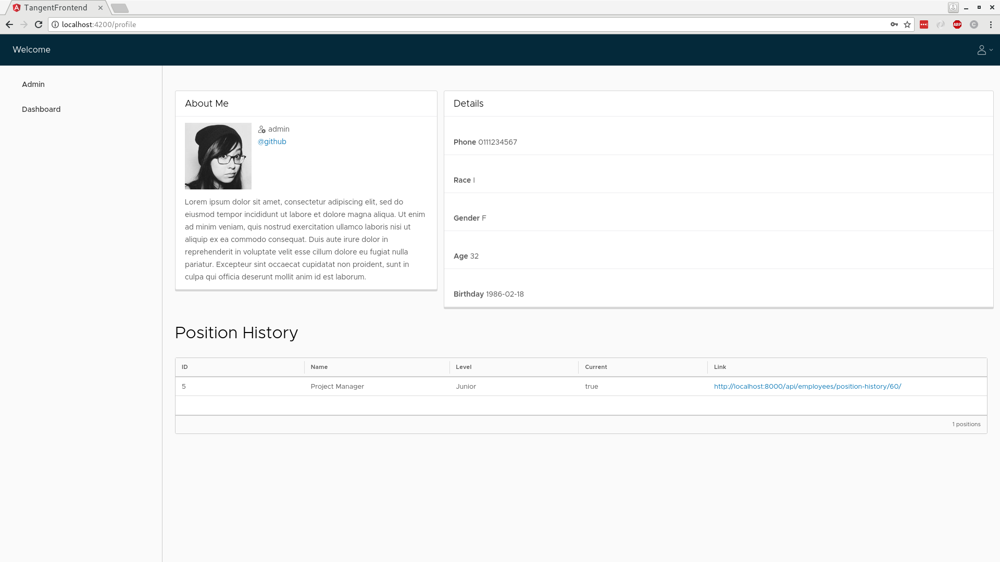
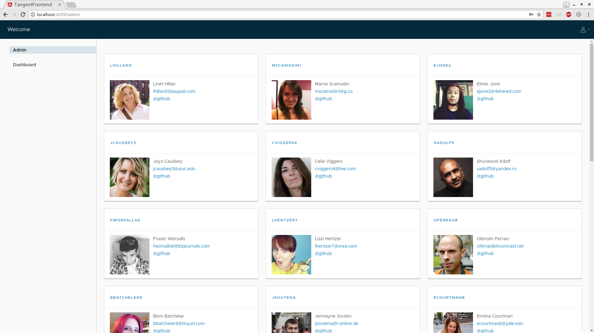
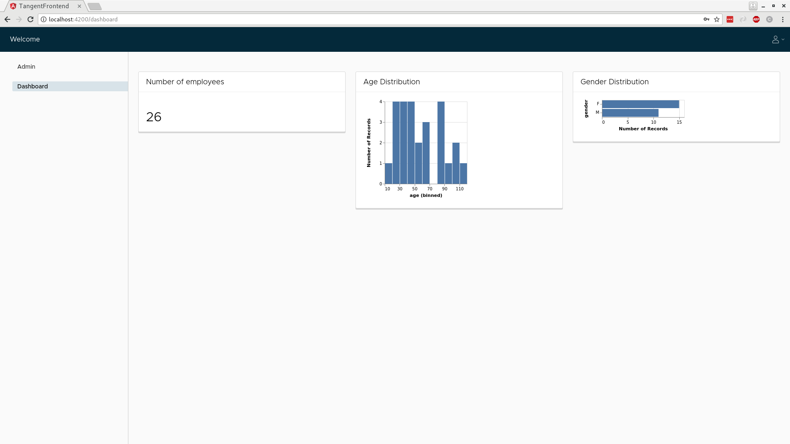

# Tangent assignment frontend

Angular frontend for the tangent assignment.

# Running the build

You can run the build by serving the index.html page as in the dist folder as follows. Make sure you have the tanget-backend running.

```bash
cd dist
python -m http.server 4200
```


# Screenshots







# Dev Installation

```bash
git clone https://github.com/BradleyKirton/tangent-frontent
cd tangent-frontent
npm install
npm start
```
